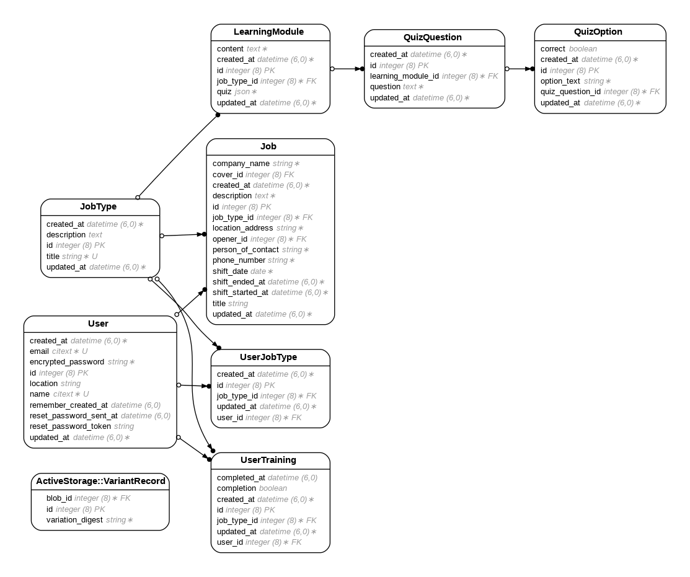

# ShiftCover
## Djvon Simpson

ShiftCover is a web application that streamlines job shift postings and coverage, enabling users to post jobs, cover shifts, and complete training modules for professional certifications.

- Ruby version: `3.2.1`
- Rails version: `7.1.3.3`

### Setup Instructions:
### Local Setup Instructions

1. **Clone the repository**:
   ```bash
   git clone https://github.com/your-username/shiftcover.git
   cd shiftcover
   ```

2. **Install dependencies**:
   ```bash
   bundle install
   yarn install
   ```

3. **Set up the database**:
   ```bash
   rails db:create
   rails db:migrate
   rake sample_data
   ```

4. **Configure Amazon S3**:
   - Add a `.env` file in the root directory with:
     ```
     AWS_ACCESS_KEY_ID=your_aws_access_key
     AWS_SECRET_ACCESS_KEY=your_aws_secret_key
     AWS_BUCKET_NAME=your_bucket_name
     AWS_REGION=your_bucket_region
     ```

5. **Precompile assets**:
   ```bash
   rails assets:precompile
   ```

6. **Run the app**:
   ```bash
   rails server
   ```
   Open your browser and navigate to: `http://localhost:3000`


### ERD


We've added additional Ruby gems and other software that aren't automatically available in a new Rails app, and configured 

### UJS and Turbo

In Rails version 7, support for Unobtrusive JavaScript (UJS) is not the default. Rather, [this has been replaced with Turbo](https://guides.rubyonrails.org/working_with_javascript_in_rails.html#turbo).

However, in AppDev, we typically want to first demonstrate UJS and then enable Turbo manually when we want it.

Therefore, UJS has been pre-configured here with these steps: 

- Pin UJS + jQuery in `config/importmap.rb` by running:

    ```
    % ./bin/importmap pin @rails/ujs
    % ./bin/importmap pin jquery
    ```

- Add UJS + jQuery via:

    ```js
    // app/javascript/application.js
    import jquery from "jquery";
    window.jQuery = jquery;
    window.$ = jquery;
    import Rails from "@rails/ujs"
    Rails.start();
    ```

UJS and Turbo can co-exist side-by-side with [these instructions, which we already implemented here](https://github.com/hotwired/turbo-rails/blob/main/UPGRADING.md#upgrading-from-rails-ujs--turbolinks-to-turbo).

By default, Turbo is disabled via:

```js
// app/javascript/application.js
import { Turbo } from "@hotwired/turbo-rails"
Turbo.session.drive = false
```

Set it to `true` to enable Turbo everywhere, or you can use `data-turbo="true"` to enable Drive on a per-element basis while leaving it globally `false`.

### Additional gems:

- [`appdev_support`](https://github.com/firstdraft/appdev_support)
- [`annotate`](https://github.com/ctran/annotate_models)
- [`awesome_print`](https://github.com/awesome-print/awesome_print)
- [`better_errors`](https://github.com/BetterErrors/better_errors)
- [`binding_of_caller`](https://github.com/banister/binding_of_caller)
- [`dotenv-rails`](https://github.com/bkeepers/dotenv)
- [`draft_generators`](https://github.com/firstdraft/draft_generators/)
- [`draft_matchers`](https://github.com/jelaniwoods/draft_matchers/)
- [`devise`](https://github.com/heartcombo/devise)
- [`faker`](https://github.com/faker-ruby/faker)
- [`grade_runner`](https://github.com/firstdraft/grade_runner/)
- [`htmlbeautifier`](https://github.com/threedaymonk/htmlbeautifier/)
- [`http`](https://github.com/httprb/http)
- [`pry_rails`](https://github.com/pry/pry-rails)
- [`rails_db`](https://github.com/igorkasyanchuk/rails_db)
- [`rails-erd`](https://github.com/voormedia/rails-erd)
- [`rspec-html-matchers`](https://github.com/kucaahbe/rspec-html-matchers)
- [`rspec-rails`](https://github.com/rspec/rspec-rails)
- [`rufo`](https://github.com/ruby-formatter/rufo)
- [`specs_to_readme`](https://github.com/firstdraft/specs_to_readme)
- [`table_print`](https://github.com/arches/table_print)
- [`web_git`](https://github.com/firstdraft/web_git)
- [`webmock`](https://github.com/bblimke/webmock)

### Additional software:
- OS Ubuntu 20.04.5 LTS
- Chromedriver
- Fly.io's `flyctl`
- Google Chrome (headless browser)
- Graphviz
- Node JS 18
- NPM 8.19.3
- Postgresql 12
- Redis
- Yarn

### VS Code extensions:
- vortizhe.simple-ruby-erb
- mbessey.vscode-rufo
- aliariff.vscode-erb-beautify
- eamodio.gitlens
- setobiralo.erb-commenter
